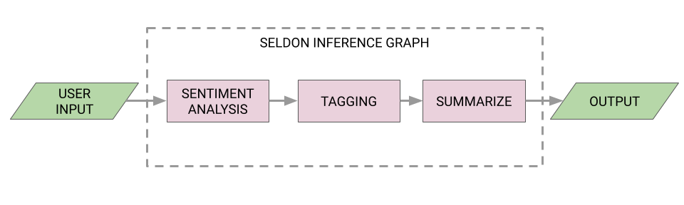

# seldon-inference-graph

In this demo, we will use the Seldon graph capability to create a inference graph that captures the sentiment of a text,
generates tags and summarises the message.



The project makes use of the Seldon
Core's [Python wrapper](https://docs.seldon.io/projects/seldon-core/en/latest/python/python_component.html) which helps
create containerized models to be deployed ion Seldon cluster.  

### Steps to run the application 

#### [Install AWS CLI Version 2](https://docs.aws.amazon.com/cli/latest/userguide/getting-started-install.html)
#### [Configure AWS CLI](https://docs.aws.amazon.com/cli/latest/userguide/cli-chap-configure.html)
#### [Install eksctl](https://docs.aws.amazon.com/eks/latest/userguide/eksctl.html)
#### Create EKS Cluster:
```angular2html
eksctl create cluster \
--name seldon-serving-cluster \
--version 1.21 \
--tags environment=dev \
--region eu-west-2 \
--nodegroup-name linux-nodes \
--node-type t3.medium \
--nodes 2 \
--nodes-min 2 \
--nodes-max 2 \
--managed
```
#### Install [kubectl](https://kubernetes.io/docs/tasks/tools/#kubectl)
Example: On macOS, install using Homebrew
```angular2html
brew install kubectl
```
#### Configure Kubectl:
Update the kubeconfig, once the cluster is created:
```angular2html
aws eks --region eu-west-2 update-kubeconfig --name seldon-serving-cluster
```

#### Verify Kubernetes Setup
This should highlight the control plane and DNS details
```angular2html
kubectl cluster-info
```
#### Helm
You'll need Helm version equal or higher than 3.0.

Follow the [latest Helm docs](https://helm.sh/docs/intro/install/) to find the setup option that best suits your needs.

For example, to install helm with Homebew on macOS run:
```angular2html
brew install helm
```
#### Ingress
In order to route traffic to your models you will need to install Ingress. Seldon Core supports Istio or Ambassador. In this tutorial we will use Ambassador.

Follow the [latest Ambassador docs](https://www.getambassador.io/docs/edge-stack/latest/topics/install/) to find the setup option that best suits your needs.

For example, to install via helm 3 run:
```angular2html
helm repo add datawire https://www.getambassador.io
kubectl create namespace ambassador
helm install ambassador --namespace ambassador datawire/ambassador
```
Finish the installation by running the following command:
```angular2html
edgectl install
```
[Edge Control](https://www.getambassador.io/docs/edge-stack/1.14/topics/using/edgectl/edge-control/) (edgectl) automatically configures TLS for your instance and provisions a domain name for your Ambassador Edge Stack. This is not necessary if you already have a domain name and certificates.

The output will contain the created DNS, for example:
```angular2html
Congratulations! You've successfully installed the Ambassador Edge Stack in
your Kubernetes cluster. You can find it at your custom URL:
https://great-shtern-3456.edgestack.me/
```

You can get the hosts name by getting the custom `host` resource from the kubernetes cluster. Save it in a variable for a later use:
```angular2html
export LOAD_BALANCER_URL=$(kubectl get host -n ambassador -o jsonpath='{.items[0].spec.hostname}')
echo $LOAD_BALANCER_URL
```
#### Install Seldon Core
Follow the [latest doc](https://docs.seldon.io/projects/seldon-core/en/latest/workflow/install.html) to install Seldon. 

For example, to install via helm 3 run:
```angular2html
kubectl create namespace seldon-system
helm install seldon-core seldon-core-operator \
    --repo https://storage.googleapis.com/seldon-charts \
    --set usageMetrics.enabled=true \
    --namespace seldon-system \
    --set ambassador.enabled=true
```
#### Create namespace for the models to run
```angular2html
kubectl create namespace seldon
```
#### Deploy modules
Please navigate to the `sentiment-analysis`, `text-tagging` and `summarize-text` modules in this project and using the s2i Seldon utility, deploy the containers onto your Docker repo.
Refer to the README.md files in their respective modules

#### Install 
Once the Docker modules are created/deployed into the repo, please update the `deploy.json` file in the root directory with appropriate image name/version.

Then, deploy it to the cluster using
```
kubectl apply -f deploy.json
```

#### Access the service 
I have used [postman](https://www.postman.com/) to query the service with below parameters: 

Header: `content-type=application/json`

POST URL: `http://nn.nn.nn.nn/seldon/seldon/seldon-pipeline/api/v0.1/predictions`

Body, Raw (JSON type) : 
```
{
  "data": {
    "ndarray": [
      "In an attempt to build an AI-ready workforce, Microsoft announced Intelligent Cloud Hub which has been launched to empower the next generation of students with AI-ready skills. Envisioned as a three-year collaborative program, Intelligent Cloud Hub will support around 100 institutions with AI infrastructure, course content and curriculum, developer support, development tools and give students access to cloud and AI services. As part of the program, the Redmond giant which wants to expand its reach and is planning to build a strong developer ecosystem in India with the program will set up the core AI infrastructure and IoT Hub for the selected campuses. The company will provide AI development tools and Azure AI services such as Microsoft Cognitive Services, Bot Services and Azure Machine Learning. According to Manish Prakash, Country General Manager-PS, Health and Education, Microsoft India, said, With AI being the defining technology of our time, it is transforming lives and industry and the jobs of tomorrow will require a different skillset. This will require more collaborations and training and working with AI. That’s why it has become more critical than ever for educational institutions to integrate new cloud and AI technologies. The program is an attempt to ramp up the institutional set-up and build capabilities among the educators to educate the workforce of tomorrow. The program aims to build up the cognitive skills and in-depth understanding of developing intelligent cloud connected solutions for applications across industry. Earlier in April this year, the company announced Microsoft Professional Program In AI as a learning track open to the public. The program was developed to provide job ready skills to programmers who wanted to hone their skills in AI and data science with a series of online courses which featured hands-on labs and expert instructors as well. This program also included developer-focused AI school that provided a bunch of assets to help build AI skills"
    ],
    "names": "message"
  },
  "meta": {
    "tags": {
    }
  }
}
```

You should see the below output:
```
{
    "data": {
        "names": [],
        "ndarray": [
            "In an attempt to build an AI-ready workforce, Microsoft announced Intelligent Cloud Hub which has been launched to empower the next generation of students with AI-ready skills. Envisioned as a three-year collaborative program, Intelligent Cloud Hub will support around 100 institutions with AI infrastructure, course content and curriculum, developer support, development tools and give students access to cloud and AI services. As part of the program, the Redmond giant which wants to expand its reach and is planning to build a strong developer ecosystem in India with the program will set up the core AI infrastructure and IoT Hub for the selected campuses. The company will provide AI development tools and Azure AI services such as Microsoft Cognitive Services, Bot Services and Azure Machine Learning. According to Manish Prakash, Country General Manager-PS, Health and Education, Microsoft India, said, With AI being the defining technology of our time, it is transforming lives and industry and the jobs of tomorrow will require a different skillset. This will require more collaborations and training and working with AI. That’s why it has become more critical than ever for educational institutions to integrate new cloud and AI technologies. The program is an attempt to ramp up the institutional set-up and build capabilities among the educators to educate the workforce of tomorrow. The program aims to build up the cognitive skills and in-depth understanding of developing intelligent cloud connected solutions for applications across industry. Earlier in April this year, the company announced Microsoft Professional Program In AI as a learning track open to the public. The program was developed to provide job ready skills to programmers who wanted to hone their skills in AI and data science with a series of online courses which featured hands-on labs and expert instructors as well. This program also included developer-focused AI school that provided a bunch of assets to help build AI skills"
        ]
    },
    "meta": {
        "metrics": [
            {
                "key": "mycounter",
                "type": "COUNTER",
                "value": 1
            },
            {
                "key": "mygauge",
                "type": "GAUGE",
                "value": 100
            },
            {
                "key": "mytimer",
                "type": "TIMER",
                "value": 20.2
            }
        ],
        "requestPath": {
            "sentiment-analysis": "urthilak/sentiment-analysis:0.1.11",
            "summarize-text": "urthilak/summarize-text:0.1.5",
            "text-tagging": "urthilak/text-tagging:0.1.8"
        },
        "tags": {
            "input_text": "In an attempt to build an AI-ready workforce, Microsoft announced Intelligent Cloud Hub which has been launched to empower the next generation of students with AI-ready skills. Envisioned as a three-year collaborative program, Intelligent Cloud Hub will support around 100 institutions with AI infrastructure, course content and curriculum, developer support, development tools and give students access to cloud and AI services. As part of the program, the Redmond giant which wants to expand its reach and is planning to build a strong developer ecosystem in India with the program will set up the core AI infrastructure and IoT Hub for the selected campuses. The company will provide AI development tools and Azure AI services such as Microsoft Cognitive Services, Bot Services and Azure Machine Learning. According to Manish Prakash, Country General Manager-PS, Health and Education, Microsoft India, said, With AI being the defining technology of our time, it is transforming lives and industry and the jobs of tomorrow will require a different skillset. This will require more collaborations and training and working with AI. That’s why it has become more critical than ever for educational institutions to integrate new cloud and AI technologies. The program is an attempt to ramp up the institutional set-up and build capabilities among the educators to educate the workforce of tomorrow. The program aims to build up the cognitive skills and in-depth understanding of developing intelligent cloud connected solutions for applications across industry. Earlier in April this year, the company announced Microsoft Professional Program In AI as a learning track open to the public. The program was developed to provide job ready skills to programmers who wanted to hone their skills in AI and data science with a series of online courses which featured hands-on labs and expert instructors as well. This program also included developer-focused AI school that provided a bunch of assets to help build AI skills",
            "sentiment_analysis_passed": true,
            "sentiment_analysis_result": {
                "compound": 0.9769,
                "neg": 0.008,
                "neu": 0.893,
                "pos": 0.099
            },
            "summarize_text_passed": true,
            "summarize_text_result": "[' As part of the program, the Redmond giant which wants to expand its reach and is planning to build a strong developer ecosystem in India with the program will set up the core AI infrastructure and IoT Hub for the selected campuses', ' The program was developed to provide job ready skills to programmers who wanted to hone their skills in AI and data science with a series of online courses which featured hands-on labs and expert instructors as well']",
            "tags": "['#collaboration', '#skillset', '#different', '#life', '#transforming']",
            "text_tagging_passed": true
        }
    }
}
```
Alternatively, using Curl:
```angular2html
curl -X POST -H 'Content-Type: application/json' -d '{"meta": {"tags": {}},"data": {"names": ["message"],"ndarray": ["In an attempt to build an AI-ready workforce, Microsoft announced Intelligent Cloud Hub which has been launched to empower the next generation of students with AI-ready skills. Envisioned as a three-year collaborative program, Intelligent Cloud Hub will support around 100 institutions with AI infrastructure, course content and curriculum, developer support, development tools and give students access to cloud and AI services. As part of the program, the Redmond giant which wants to expand its reach and is planning to build a strong developer ecosystem in India with the program will set up the core AI infrastructure and IoT Hub for the selected campuses. The company will provide AI development tools and Azure AI services such as Microsoft Cognitive Services, Bot Services and Azure Machine Learning. According to Manish Prakash, Country General Manager-PS, Health and Education, Microsoft India, said, With AI being the defining technology of our time, it is transforming lives and industry and the jobs of tomorrow will require a different skillset. This will require more collaborations and training and working with AI. That’s why it has become more critical than ever for educational institutions to integrate new cloud and AI technologies. The program is an attempt to ramp up the institutional set-up and build capabilities among the educators to educate the workforce of tomorrow. The program aims to build up the cognitive skills and in-depth understanding of developing intelligent cloud connected solutions for applications across industry. Earlier in April this year, the company announced Microsoft Professional Program In AI as a learning track open to the public. The program was developed to provide job ready skills to programmers who wanted to hone their skills in AI and data science with a series of online courses which featured hands-on labs and expert instructors as well. This program also included developer-focused AI school that provided a bunch of assets to help build AI skills"]}}' http://nn.nn.nn.nn/seldon/default/seldon-pipeline/api/v0.1/predictions
```

